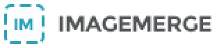

# Image-Merge
Node tool to manage the generation of multiple assets into one page.

## Getting Started
To get started using Image-Merge run the following commands in your terminal:

```
git clone https://github.com/Polyneue/Image-Merge.git
cd Image-Merge
npm install
```

Now you can begin adding your assets and creating your pages. 

## Setting Up the Assets Folder
Begin breaking down your PSD file into reusable and unique assets. *(For an example, view the file structure in the assets/example folder)* You'll then need to update the `page-config.js` file with the page objects and their asset order/locations.

## Final Steps
Run the Image-Merge tool using `node app` from within the Image-Merge directory. The results will be in `./dist`, you can find a sample of the example files within this directory as well.
